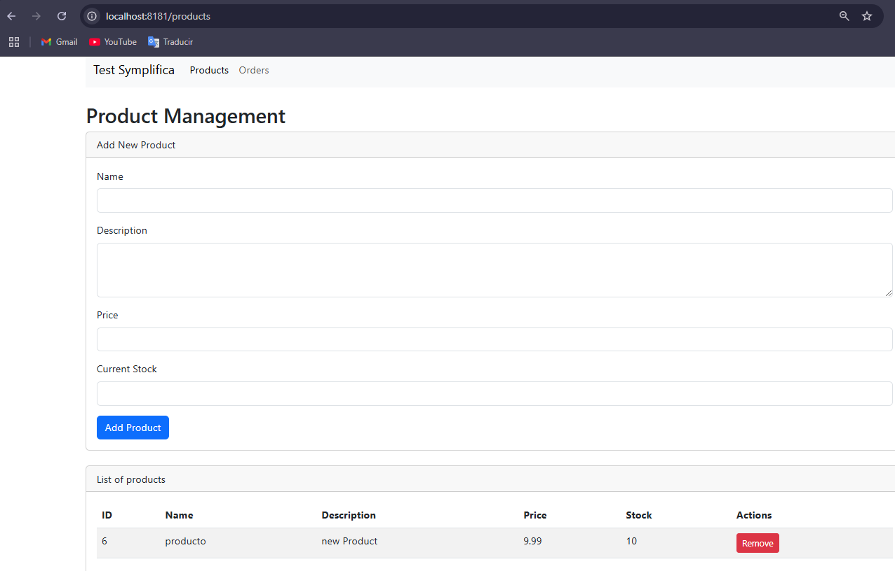
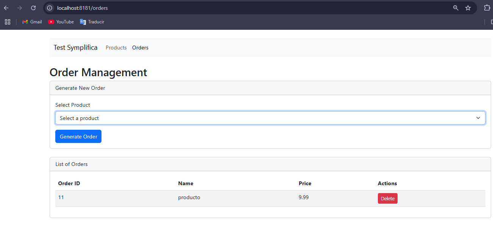

# Test-Symplifica
Technical Test for Symplifica

-----

Web Aplication with Spring Boot  that enables product and order management.

---

## Prerequisites
 * Java 21
 * Maven 
 * SpringBoot 3.4.0
 * PostgreSQL 15
 * Thymeleaf
 * Flyway

---

## Dependencies
* Spring Web
* Spring Data JPA
* PostgreSQL Driver 
* Lombok
* Flyway Migration 
* Thymeleaf 
* Validation 
* Spring Boot DevTools

---

## Proyect Setup

1. Clone the repository:
   ```bash
   git clone https://github.com/HansDussich/Test-Symplifica
   ```
2. Navigate to the project directory:
   ```bash
   cd Test-Symplifica
   ```
3. Open with your IDE

4. Create Database in PostgreSQL with the name `db_testSymplifica`

5. Configure in `application.properties` your `username` and `password`   

6. Build the project
```bash
  mvn clean install
```
7. Run the application
```bash
  mvn spring-boot:run
```

---

## Open the Browser and search
* Products
    `http://localhost:8181/products`

* Orders
    `http://localhost:8181/orders`

---

###  Products


### Orders
